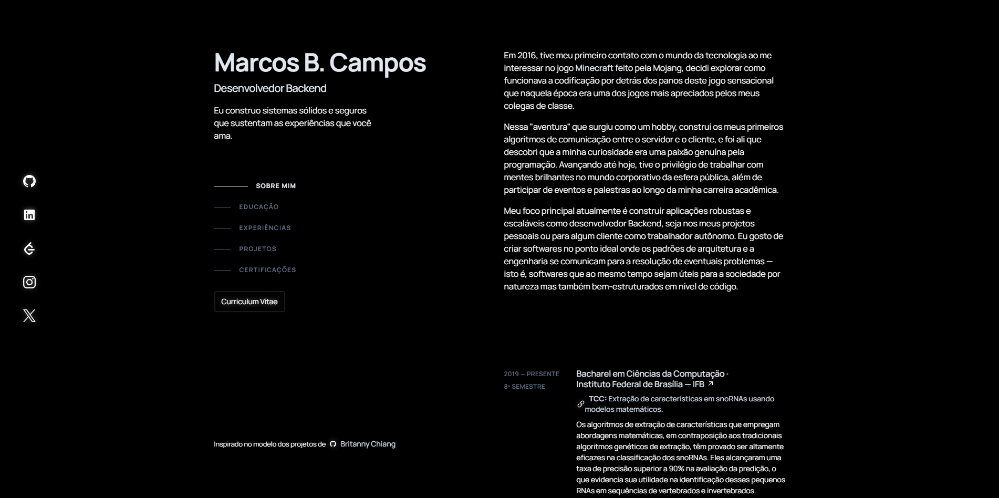

<h1 align="center">Portfolio v2</h1>

<div align="center">

[](https://github.com/neovim/neovim)


</div>

<figure align="center">
    <a href="https://marcoscampos-v2.vercel.app/" target="_blank">
    </a>
</figure>

<div align="center">Click on the image above to redirect to the website</div>

## Project Setup

```sh
npm install
yarn install
```

### Compile and Hot-Reload for Development

```sh
npm run dev
yarn run dev
```

### Type-Check, Compile and Minify for Production

```sh
npm run build
yarn run build
```

